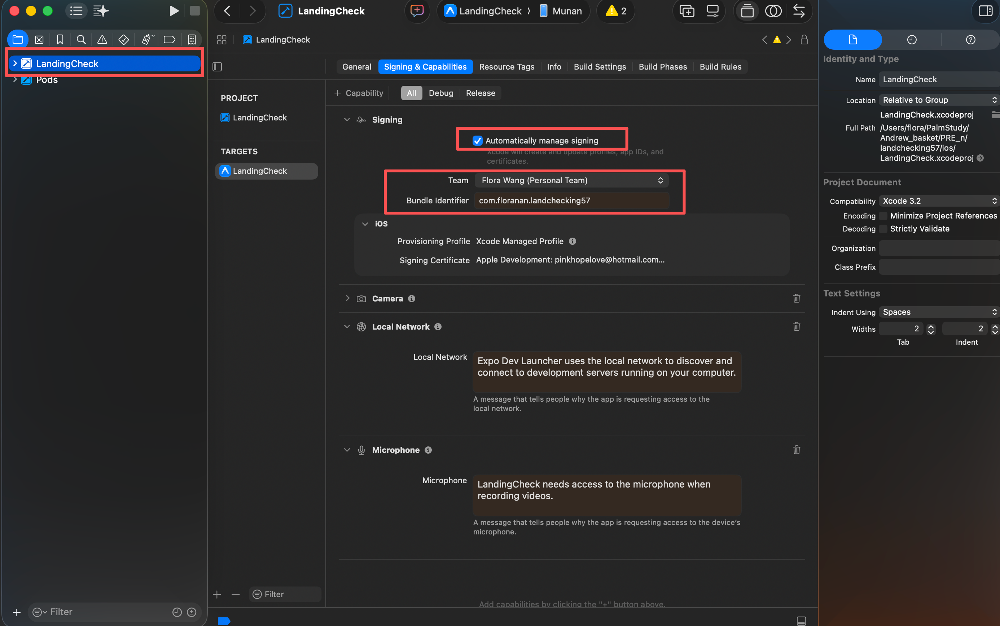
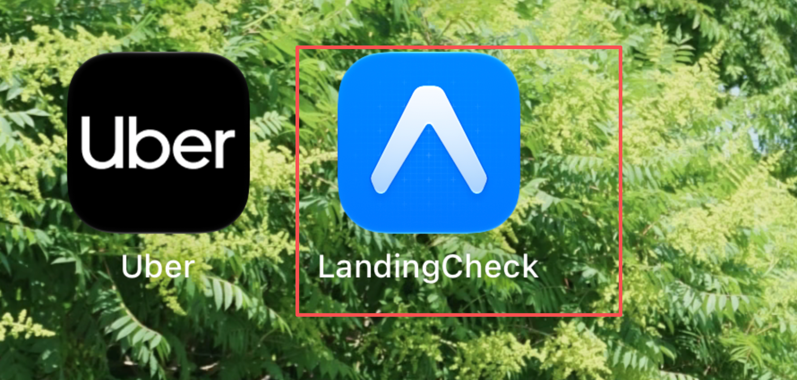
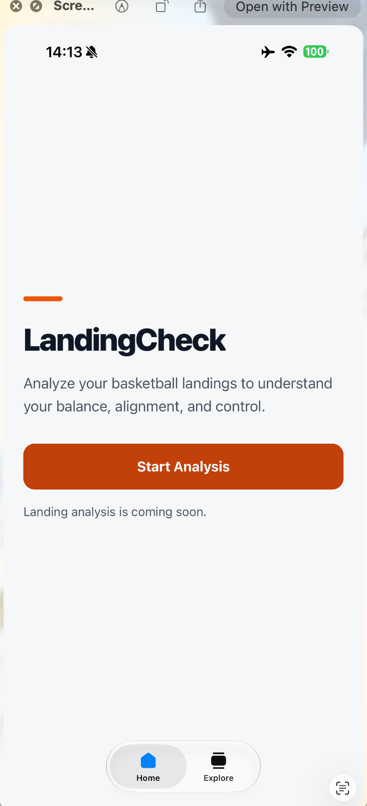

# LandingCheck — Local iPhone Setup and First UI

This guide helps student set up LandingCheck on their own Mac, create an iOS development build, run it on their own iPhone, and complete the first vibe-coding activity.

LandingCheck currently contains the original Expo starter screen. In this lesson, we will build only a simple homepage. We will **not** add camera access, MediaPipe, pose detection, or landing-analysis logic yet.

## What you will complete

By the end of this setup, you should have:

- The LandingCheck repository open in VS Code
- All JavaScript dependencies installed
- Xcode connected to your Apple Account
- Developer Mode enabled on your iPhone
- A LandingCheck development build installed on your iPhone
- A simple LandingCheck homepage created through vibe coding
- Your work committed and pushed to GitHub

## 1. Required equipment and software

You need:

- A Mac
- An iPhone running iOS 16 or later
- A USB cable that supports data transfer
- A free Apple Account
- A stable internet connection
- [Node.js LTS](https://nodejs.org/)
- [Git](https://git-scm.com/downloads)
- [Visual Studio Code](https://code.visualstudio.com/)
- [Xcode](https://apps.apple.com/app/xcode/id497799835) from the Mac App Store
- [Expo Go](https://expo.dev/go) for an optional starter test

A free Apple Account and Xcode Personal Team are sufficient for this local classroom build. A paid Apple Developer Program membership is not required for this activity.

## 2. Get the project onto your Mac

Use the GitHub repository link supplied by your instructor.

You can clone it in Terminal:

```bash
git clone <repository-url>
cd landchecking57
code .
```

Replace `<repository-url>` with the real URL from GitHub.

If you downloaded a ZIP file instead, unzip it, open VS Code, select **File > Open Folder**, and choose the `landchecking57` folder.

Do not create another Expo project inside this folder. The class repository is already an Expo SDK 57 project.

### How the original project was created

For reference, the instructor originally created the project with:

```bash
npx create-expo-app@latest landchecking57
```

The **SDK 57** option was selected. Students using the class repository do not need to run this command again.

## 3. Confirm that Terminal is in the correct folder

Open the VS Code terminal and run:

```bash
pwd
```

The path should end in:

```text
landchecking57
```

Check that the folder contains at least:

```text
app.json
package.json
src/
assets/
```

## 4. Install the existing dependencies

Run:

```bash
npm install
```

This installs the packages already listed in `package.json`. Do not add camera or MediaPipe packages during this lesson.

Check the project:

```bash
npx expo-doctor
```

The expected result is that all checks pass.

## 5. Optional: test the starter page with Expo Go

Before configuring Xcode, you can confirm that the JavaScript project works:

```bash
npx expo start --go
```

Then scan the QR code with the iPhone Camera app and open the project in Expo Go.

You should see the original Expo starter screen. Stop the server with `Control + C` before continuing.

> Expo Go is useful for this starter test. Later native features such as MediaPipe will require the custom development build that we create below.

## 6. Finish the Xcode installation

1. Install Xcode from the Mac App Store.
2. Open Xcode once.
3. Accept the license agreement.
4. Allow Xcode to install its additional components.
5. Open **Xcode > Settings > Locations**.
6. Under **Command Line Tools**, select the installed Xcode version.

In Terminal, run:

```bash
sudo xcode-select -s /Applications/Xcode.app/Contents/Developer
sudo xcodebuild -runFirstLaunch
xcodebuild -version
```

When Terminal asks for a password, enter your **Mac login password**. Nothing appears on the screen while you type the password; this is normal.

## 7. Add your Apple Account to Xcode

1. Open **Xcode > Settings > Accounts**.
2. Click the **+** button.
3. Select **Apple Account**.
4. Sign in with your own Apple Account.
5. Confirm that your account appears with a **Personal Team**.

You do not need to use the instructor's Apple Account.

## 8. Connect your iPhone to the Mac

1. Connect the unlocked iPhone to the Mac using a USB cable.
2. If the iPhone displays **Trust This Computer?**, tap **Trust**.
3. Enter the iPhone passcode.
4. If macOS asks whether accessories may connect, click **Allow**.
5. Keep the iPhone unlocked while Xcode prepares it.

To check the device in Xcode:

- In some Xcode versions, choose **Window > Devices and Simulators**.
- In newer Xcode versions, choose **Xcode > Open Developer Tool > Device Hub**.
- You can also look for your iPhone in the run-destination menu at the top of an open Xcode project.

Wait until Xcode finishes preparing the device.

## 9. Enable Developer Mode on the iPhone

After Xcode recognizes the phone:

1. On the iPhone, open **Settings**.
2. Open **Privacy & Security**.
3. Scroll down and select **Developer Mode**.
4. Turn on Developer Mode.
5. Tap **Restart**.
6. After the iPhone restarts, unlock it.
7. When iOS asks for confirmation, tap **Turn On**.
8. Enter the iPhone passcode.

If Developer Mode is not visible, reconnect the iPhone, unlock it, and allow Xcode to recognize or prepare the device first. Then check **Settings > Privacy & Security** again.

Developer Mode is normally a one-time setup for each iPhone.

## 10. Create a unique bundle identifier

Every student needs a unique iOS bundle identifier. Open `app.json` and find:

```json
"bundleIdentifier": "com.floranan.landchecking57"
```

Replace it with your own value, for example:

```json
"bundleIdentifier": "com.andrewchen.landchecking57"
```

Use your own name. Use only lowercase letters, numbers, dots, and hyphens. Do not use spaces.

If you plan to build Android later, also change `android.package` to your unique identifier.

## 11. Generate the native iOS project

Make sure you are in the project root, then run:

```bash
npx expo prebuild --platform ios --clean
```

This generates the `ios` folder and installs the required CocoaPods.

Use `--clean` for the first native setup or when the instructor specifically asks you to regenerate the native project. It is not needed for normal homepage edits.

## 12. Open the iOS workspace

Run:

```bash
open ios/LandingCheck.xcworkspace
```

Always open the `.xcworkspace` file, not the `.xcodeproj` file.

If the workspace name is different, open Finder, look inside the `ios` folder, and open the file ending in `.xcworkspace`.

## 13. Configure signing in Xcode

In Xcode:

1. Select the blue **LandingCheck** project in the left sidebar.
2. Under **TARGETS**, select **LandingCheck**.
3. Open **Signing & Capabilities**.
4. Check **Automatically manage signing**.
5. Set **Team** to your name followed by **(Personal Team)**.
6. Confirm that the Bundle Identifier is your unique value.
7. Select your connected iPhone as the run destination.

Do not change signing settings inside the **Pods** project.

Wait for Xcode to create the development certificate and provisioning profile. Any red signing message should disappear before you continue.

## 14. Build and install the app on your iPhone

Return to the VS Code terminal. Keep the iPhone connected and unlocked, then run:

```bash
npm run ios:device
```

Select your iPhone when prompted.

The first build may take several minutes. During the build:

- Keep the iPhone unlocked.
- Allow connection prompts on the Mac and iPhone.
- If macOS asks for access to an Apple Development key, enter your Mac login password.
- On your own Mac, choose **Always Allow** if the same Keychain request keeps appearing.

When installation finishes, LandingCheck should appear on the iPhone.

## 15. Trust the development app if required

If iOS refuses to open the app because the developer is not trusted:

1. Open **Settings > General > VPN & Device Management**.
2. Select your Apple Development profile.
3. Tap **Trust**.
4. Confirm the trust action.
5. Open LandingCheck again.

The app may initially show the Development Build launcher. This is normal.

## 16. Start the development server

After the development build is installed, start Metro with:

```bash
npx expo start --dev-client
```

Then:

1. Keep the Mac and iPhone on the same Wi-Fi network.
2. Open the installed **LandingCheck** app, not Expo Go.
3. Select the available development server.
4. Confirm that the Expo starter page appears.

If no server appears, leave the phone connected by USB and restart Metro with:

```bash
npx expo start --dev-client --clear
```
Then scan the QR code use your iphone.


## 17. Test the homepage on the iPhone

1. Save all files in VS Code.
2. Keep Metro running.
3. Return to LandingCheck on the iPhone.
4. Wait for Fast Refresh.
5. Check the title, description, colors, spacing, and button.

The expected page contains:

- The title **LandingCheck**
- One short description of basketball landing analysis
- A visible **Start Analysis** button
- A clean sports-inspired visual style

The button does not need to open the camera yet.

Press `r` in the Expo terminal if the app does not refresh.


## Troubleshooting

### Developer Mode does not appear

Connect and unlock the iPhone, trust the Mac, and let Xcode prepare the device. Check **Privacy & Security** again after Xcode recognizes it.

### `No code signing certificates are available`

Open **Xcode > Settings > Accounts** and confirm that your Apple Account is signed in. In **Signing & Capabilities**, select your Personal Team and enable automatic signing.

### `Failed Registering Bundle Identifier`

The identifier is already being used. Change `ios.bundleIdentifier` in `app.json` to a unique value, regenerate the iOS project, and select your Personal Team again.

### Invalid code signature or profile not trusted

Enable Developer Mode and trust your Apple Development profile under **Settings > General > VPN & Device Management**.

### `No script URL provided`

The installed development app cannot find Metro. Start it with:

```bash
npx expo start --dev-client --clear
```

Keep the Mac and iPhone on the same Wi-Fi network.

### `No development servers found`

- Confirm Metro is running.
- Keep both devices on the same network.
- Temporarily disable VPNs.
- Allow Local Network access when iOS asks.
- Keep the phone connected by USB while troubleshooting.

### `Config file contains no configuration data`

Stop Metro with `Control + C`. Remove an accidentally created empty `babel.config.js`, then restart:

```bash
npx expo start --dev-client --clear
```

### Xcode command-line tools are not selected

Run:

```bash
sudo xcode-select -s /Applications/Xcode.app/Contents/Developer
xcodebuild -version
```

### The build still contains old native packages

Only when the instructor asks you to regenerate the native project, run:

```bash
npx expo prebuild --platform ios --clean
```

Then reopen the workspace, select your Personal Team, and run `npm run ios:device` again.

### npm reports a permission error

Do not run `sudo npm install` and do not update npm with `sudo npm install -g npm`. Ask the instructor before changing file ownership or deleting npm caches.

## Daily workflow after the first setup

You normally do not need to rebuild the app for TypeScript or UI changes.

```bash
cd path/to/landchecking57
npm install
npx expo start --dev-client
```

Open LandingCheck on the iPhone and select the development server.

Run `npm run ios:device` again only when native packages or native configuration change.

## Quick command reference

| Goal | Command |
| --- | --- |
| Install existing dependencies | `npm install` |
| Check the Expo project | `npx expo-doctor` |
| Test with Expo Go | `npx expo start --go` |
| Generate the iOS project | `npx expo prebuild --platform ios --clean` |
| Open the Xcode workspace | `open ios/LandingCheck.xcworkspace` |
| Build and install on iPhone | `npm run ios:device` |
| Start the development server | `npx expo start --dev-client` |
| Start with a clean cache | `npx expo start --dev-client --clear` |
| Inspect Git changes | `git status` |

## Scope of this lesson

This lesson finishes local setup and builds the first static homepage. Camera access, MediaPipe, skeleton tracking, and landing-analysis calculations will be added in later lessons.

## Official references

- [Expo: Create a project](https://docs.expo.dev/get-started/create-a-project/)
- [Expo: Development builds](https://docs.expo.dev/develop/development-builds/introduction/)
- [Expo: iOS Developer Mode](https://docs.expo.dev/guides/ios-developer-mode/)
- [Expo SDK 57 documentation](https://docs.expo.dev/versions/v57.0.0/)
